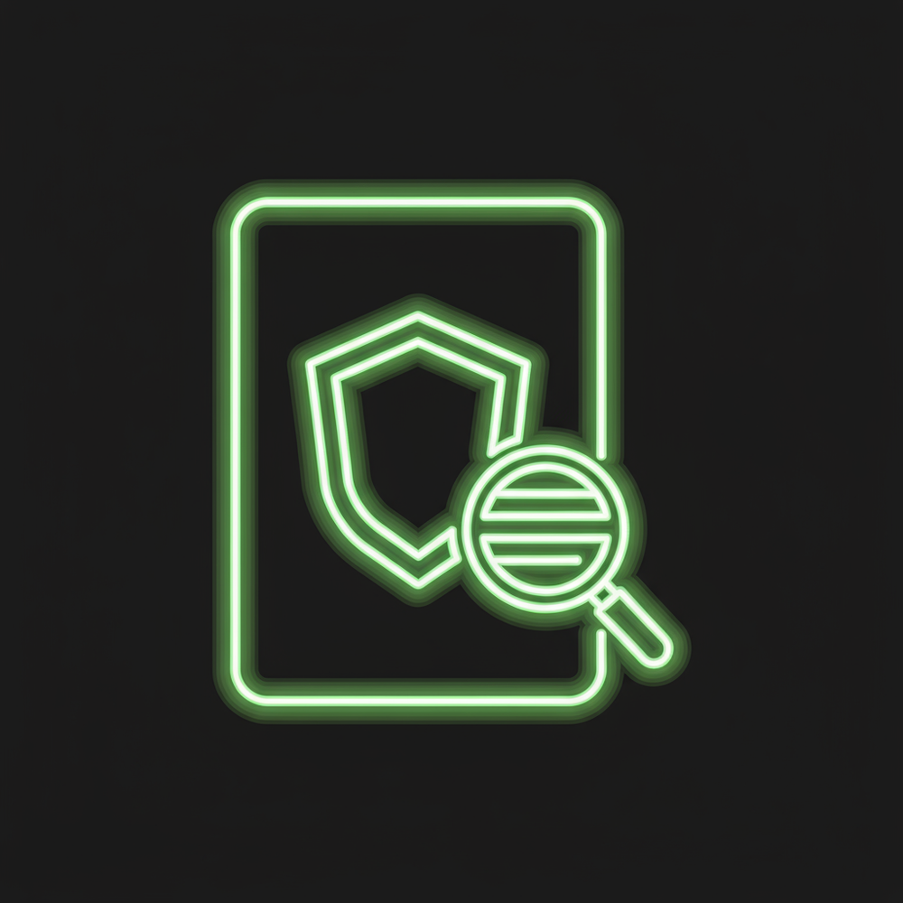

# Privacy Calendar - Icon Usage Guide

## Overview

The Privacy Calendar application uses a cohesive set of professional icons that represent the brand identity and core features. This guide documents all icons, their usage, and integration points.

---

## Icon Assets

### 1. **Privacy Calendar Logo** (`logo.png`)
**File:** `assets/logo.png`
**Dimensions:** 2200 x 700 pixels (recommended display: 200px width)
**Purpose:** Full branding logo with company name

**Usage Locations:**
- CTA section (Call-to-Action) - featured prominently
- Marketing materials and print
- Social media headers
- Website footer (optional)

**Color Scheme:**
- Lime green (#7FFF00) - Primary
- White text - Secondary
- Shield with lock - Security symbol
- Lightning bolt - Speed/Energy

**Display Settings:**
```html

```

---

### 2. **Privacy Calendar App Icon** (`app-icon.png`)
**File:** `assets/app-icon.png`
**Dimensions:** 1400 x 1400 pixels (recommended display: 120px width)
**Purpose:** Application icon for desktop and mobile installations

**Usage Locations:**
- Hero section (main landing page)
- App store listings
- Desktop shortcuts
- Mobile home screens
- Browser bookmarks

**Color Scheme:**
- Lime green (#7FFF00) - Primary
- White background - Secondary
- Calendar grid with shield - Core concept
- Lock symbol - Privacy focus

**Display Settings:**
```html

```

**Animation:**
- Floating animation (3s duration)
- Subtle drop shadow effect
- Responsive scaling

---

### 3. **Data Privacy Icon** (`data-privacy-icon.png`)
**File:** `assets/data-privacy-icon.png`
**Dimensions:** 1000 x 1000 pixels (recommended display: 100px width)
**Purpose:** Modern neon-style data protection symbol

**Usage Locations:**
- Security/Privacy section header
- Feature highlights
- Marketing materials
- Documentation headers
- Compliance badges

**Color Scheme:**
- Neon green (#7FFF00) - Primary
- Dark background (#1a1a1a) - Secondary
- Glowing effect - Modern aesthetic
- Shield and magnifying glass - Data protection

**Display Settings:**
```html

```

**Special Effects:**
- Drop shadow for depth
- Glowing neon effect
- High contrast on dark backgrounds

---

### 4. **Privacy Calendar Icon** (`calendar-icon.png`)
**File:** `assets/calendar-icon.png`
**Dimensions:** 1000 x 1000 pixels (recommended display: 40px width)
**Purpose:** Compact icon for navigation and branding

**Usage Locations:**
- Navigation bar logo
- Favicon (browser tab)
- Footer branding
- Mobile app icon
- Bookmark icons
- Social media avatars

**Color Scheme:**
- Lime green (#7FFF00) - Primary
- Dark circular background - Secondary
- Calendar grid - Core concept
- Lock symbol - Privacy focus
- Shield badge - Protection

**Display Settings:**
```html
<!-- Navigation Bar -->


<!-- Favicon -->
<link rel="icon" type="image/png" href="assets/calendar-icon.png">

<!-- Footer -->

```

---

## Icon Integration in Demo

### Navigation Bar
```html
<div class="logo">
    
    <span class="logo-text">Privacy Calendar</span>
</div>
```

**CSS Styling:**
```css
.logo-img {
    width: 40px;
    height: 40px;
    border-radius: 50%;
    object-fit: contain;
    background: rgba(127, 255, 0, 0.1);
    padding: 4px;
}
```

### Hero Section
```html
<div class="hero-icon">
    
</div>
```

**CSS Styling:**
```css
.hero-app-icon {
    width: 120px;
    height: 120px;
    object-fit: contain;
    filter: drop-shadow(0 0 20px rgba(127, 255, 0, 0.3));
    animation: float 3s ease-in-out infinite;
}

@keyframes float {
    0%, 100% { transform: translateY(0px); }
    50% { transform: translateY(-10px); }
}
```

### Security Section
```html
<div class="security-header">
    
    <h2>Privacy & Security</h2>
</div>
```

**CSS Styling:**
```css
.security-icon-large {
    width: 100px;
    height: 100px;
    object-fit: contain;
    margin-bottom: var(--spacing-md);
    filter: drop-shadow(0 0 15px rgba(127, 255, 0, 0.2));
}
```

### CTA Section
```html

```

**CSS Styling:**
```css
.cta-logo {
    width: 200px;
    height: auto;
    margin-bottom: var(--spacing-lg);
    object-fit: contain;
}
```

### Footer
```html
<div class="footer-section">
    
    <p>&copy; 2024 Privacy Calendar. All rights reserved.</p>
</div>
```

**CSS Styling:**
```css
.footer-logo {
    width: 40px;
    height: 40px;
    border-radius: 50%;
    object-fit: contain;
    background: rgba(127, 255, 0, 0.1);
    padding: 4px;
}
```

---

## Theme Compatibility

All icons are designed to work seamlessly across all 5 themes:

| Theme | Icon Appearance | Background | Notes |
|-------|---|---|---|
| **Zero-Trust** | Bright neon-green | Dark (#0a0e27) | High contrast, modern |
| **Minimalist** | Soft green | Light (#f5f9f7) | Subtle, calming |
| **Enterprise** | Professional blue | Dark (#0f1419) | Corporate feel |
| **Compliance** | Gold accents | Dark (#1a1410) | Premium, trustworthy |
| **Adaptive AI** | Cyan/purple | Dark (#0a0015) | Futuristic, tech-forward |

**Theme-Aware Icon Display:**
```css
/* Icons automatically adapt to theme colors */
.logo-img {
    filter: brightness(1.1);
    /* Automatically uses theme colors */
}

body.theme-minimalist .logo-img {
    background: rgba(90, 158, 111, 0.1);
}

body.theme-enterprise .logo-img {
    background: rgba(0, 102, 204, 0.1);
}
```

---

## Responsive Design

Icons scale appropriately for all screen sizes:

```css
/* Desktop */
@media (min-width: 1024px) {
    .logo-img { width: 40px; height: 40px; }
    .hero-app-icon { width: 120px; height: 120px; }
    .security-icon-large { width: 100px; height: 100px; }
    .cta-logo { width: 200px; }
}

/* Tablet */
@media (max-width: 768px) {
    .logo-img { width: 35px; height: 35px; }
    .hero-app-icon { width: 100px; height: 100px; }
    .security-icon-large { width: 80px; height: 80px; }
    .cta-logo { width: 150px; }
}

/* Mobile */
@media (max-width: 480px) {
    .logo-img { width: 30px; height: 30px; }
    .hero-app-icon { width: 80px; height: 80px; }
    .security-icon-large { width: 60px; height: 60px; }
    .cta-logo { width: 120px; }
}
```

---

## Favicon Configuration

The calendar icon is used as the website favicon:

```html
<link rel="icon" type="image/png" href="assets/calendar-icon.png">
```

**Favicon Sizes (Optional):**
- 16x16 pixels - Browser tab
- 32x32 pixels - Bookmark
- 64x64 pixels - Windows taskbar
- 180x180 pixels - Apple touch icon

---

## Production Application Integration

### React Component Usage

```jsx
// Navigation Component
import CalendarIcon from './assets/calendar-icon.png';

export function Navigation() {
    return (
        <nav className="navbar">
            <div className="logo">
                
                <span>Privacy Calendar</span>
            </div>
        </nav>
    );
}

// Hero Component
import AppIcon from './assets/app-icon.png';

export function Hero() {
    return (
        <section className="hero">
            
            <h1>Privacy Calendar</h1>
        </section>
    );
}

// Security Component
import DataPrivacyIcon from './assets/data-privacy-icon.png';

export function SecuritySection() {
    return (
        <section className="security">
            
            <h2>Privacy & Security</h2>
        </section>
    );
}
```

---

## Asset Optimization

### File Sizes
- `logo.png` - 2.2 MB (recommended: optimize to 200-300 KB)
- `app-icon.png` - 1.4 MB (recommended: optimize to 150-200 KB)
- `data-privacy-icon.png` - 317 KB (acceptable)
- `calendar-icon.png` - 402 KB (acceptable)

### Optimization Recommendations

1. **Use WebP Format** for better compression:
   ```html
   <picture>
       <source srcset="assets/logo.webp" type="image/webp">
       
   </picture>
   ```

2. **Lazy Loading** for below-the-fold images:
   ```html
   
   ```

3. **Responsive Images**:
   ```html
   
   ```

---

## Accessibility

All icons include proper alt text and ARIA labels:

```html
<!-- Decorative icon with aria-hidden -->


<!-- Functional icon with descriptive alt -->

```

---

## Brand Guidelines

### Color Usage
- **Primary:** #7FFF00 (Lime Green)
- **Secondary:** #00D4FF (Cyan)
- **Dark Background:** #0a0e27
- **Light Background:** #f5f9f7

### Spacing
- Minimum padding around icons: 4px
- Minimum gap between icon and text: 8px
- Minimum icon size: 30px (mobile)

### Animations
- Duration: 3 seconds
- Easing: ease-in-out
- Transform: translateY (vertical floating)
- Drop shadow: 0 0 20px rgba(127, 255, 0, 0.3)

---

## Version History

| Version | Date | Changes |
|---------|------|---------|
| 1.0 | Oct 23, 2024 | Initial icon set creation |
| 1.1 | Oct 23, 2024 | Integration into demo and production app |

---

## Support

For icon customization, additional sizes, or format conversions, please refer to the main Privacy Calendar documentation or contact the development team.

---

**Last Updated:** October 23, 2024
**Status:** Production Ready
